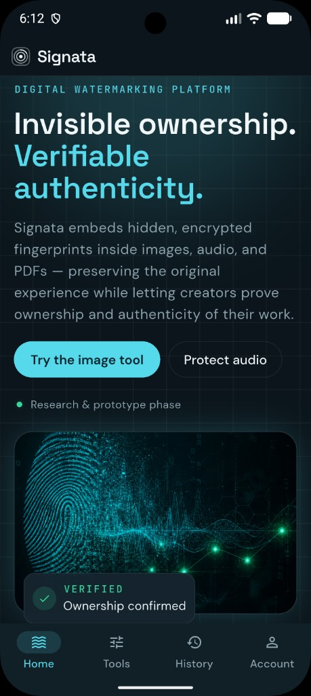
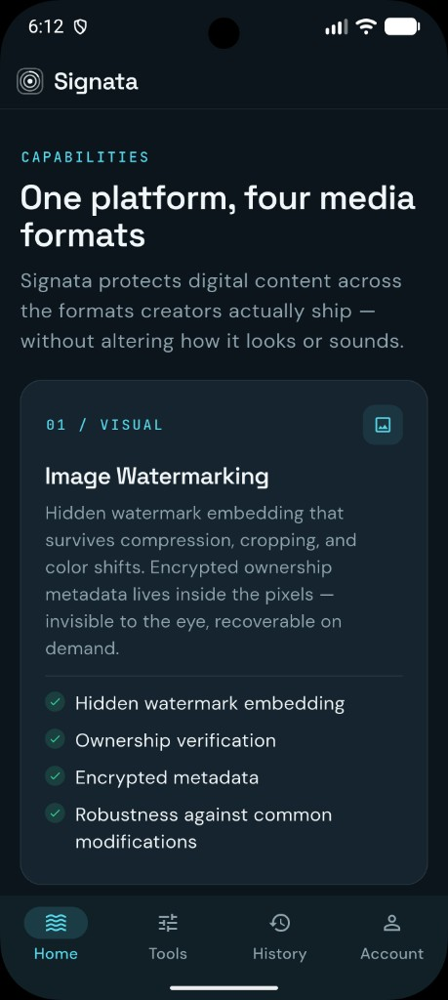
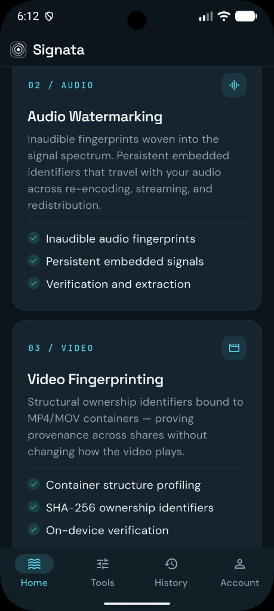
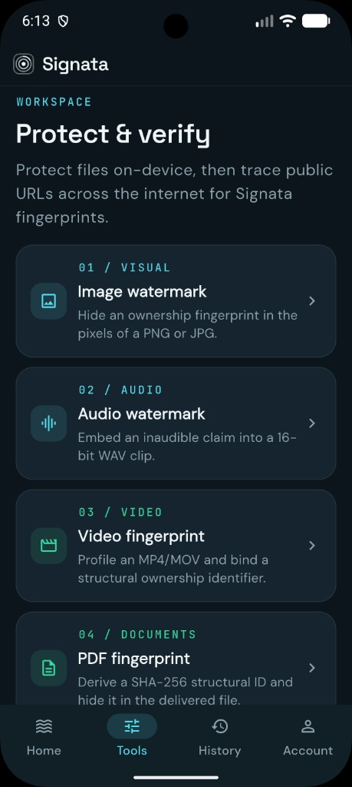
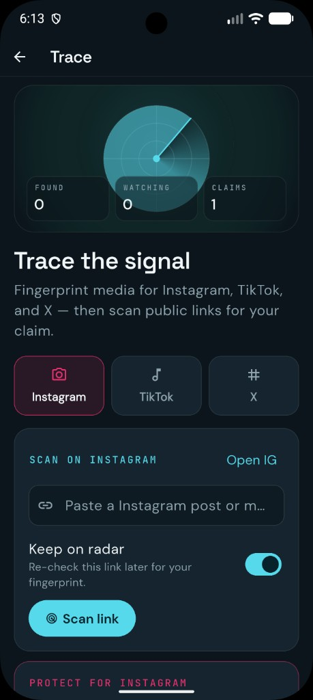

# Signata

**Invisible ownership. Verifiable authenticity.**

Native Flutter app for digital watermarking — images, audio, video, and PDFs — with processing entirely on-device.

**Latest release:** [v1.2.4](https://github.com/WejdanBa-CS/Signata/releases/tag/v1.2.4)

## Screenshots

<p align="center">
  
  
  
  
  
</p>

| Screen | File |
|--------|------|
| Home | [`docs/screenshots/01-home.png`](docs/screenshots/01-home.png) |
| Image watermarking | [`docs/screenshots/02-capabilities-image.png`](docs/screenshots/02-capabilities-image.png) |
| Audio & video | [`docs/screenshots/03-capabilities-audio-video.png`](docs/screenshots/03-capabilities-audio-video.png) |
| Tools | [`docs/screenshots/04-tools.png`](docs/screenshots/04-tools.png) |
| Trace | [`docs/screenshots/05-trace.png`](docs/screenshots/05-trace.png) |

## Features

- **Protect** — embed signed ownership fingerprints in images, audio, video (MP4/MOV), and PDFs
- **Verify** — read fingerprints back from shared files and confirm they match your claim key
- **Trace online** — scan public media URLs, watchlist re-scans, publish claims for catalog matching
- **Sealed reports** — shareable JSON verification reports with tamper detection
- **Auth** — email accounts + Google Sign-In; accounts and claim keys stay on-device
- **History** — local record of every embed/verify run
- **Privacy-first** — no Signata cloud database required; optional self-hosted claim registry

## Stack

| Layer | Tech |
|-------|------|
| App | Flutter 3.x, Dart 3.12+ |
| Crypto | PBKDF2, Ed25519-style claim signing, SHA-256 structural IDs |
| Media | On-device codecs for PNG/JPG, WAV, MP4/MOV, PDF |
| Auth | Google Sign-In (optional), local email accounts |
| Release | Android App Bundle (Play Console) |

## Quick start

```sh
git clone https://github.com/WejdanBa-CS/Signata.git
cd Signata
flutter pub get
flutter run
```

Optional remote claim registry (so other devices can look up fingerprints):

```sh
flutter run --dart-define=SIGNATA_REGISTRY_URL=https://your-registry.example
```

See [`tool/registry_server.example.md`](tool/registry_server.example.md) for the expected HTTP API. Without it, tracing still works by reading fingerprints from downloaded files and matching your on-device published claims.

## Google Sign-In (optional)

Copy `google_oauth.example.env` → `google_oauth.env` and set your Web client ID:

```env
GOOGLE_SERVER_CLIENT_ID=YOUR_WEB_CLIENT_ID.apps.googleusercontent.com
```

Then run:

```sh
flutter run --dart-define-from-file=google_oauth.env
```

Full Play release checklist: [`docs/RELEASE_PLAY.md`](docs/RELEASE_PLAY.md)

**Never commit** `google_oauth.env`, `android/key.properties`, or keystore files.

## Test

```sh
flutter test
flutter analyze
```

67 unit/integration tests cover auth, TOTP, local data, watermark round-trips, tracing, and sealed reports.

## Build Android

```sh
flutter build apk --release
# or for Play Store:
.\tool\build_release.ps1
```

APK: `build/app/outputs/flutter-apk/app-release.apk`  
AAB: `build/app/outputs/bundle/release/app-release.aab`

> On Windows, Flutter plugin builds need **Developer Mode** enabled (`start ms-settings:developers`) so symlinks work. If a Gradle build fails with a lock error, stop other Gradle/Android Studio processes and retry.

## Project layout

```
lib/
  core/           # codecs + sealed report + history + auth
  screens/        # Home / Tools / History / Account
  widgets/        # shared Signata UI
  theme.dart
  main.dart
assets/
docs/             # Play release, privacy HTML, delete-account page
docs/screenshots/ # App store / README phone screenshots
website-source/   # original React site (reference)
```

## Privacy

Full policy: [`PRIVACY.md`](PRIVACY.md) · hosted copy in [`docs/privacy.html`](docs/privacy.html)  
Terms: [`docs/terms.html`](docs/terms.html)

## License & copyright

Copyright © 2026 Wejdan Al Amri. All rights reserved.

Source is published for transparency and portfolio use. See [`LICENSE`](LICENSE) — you may not copy, redistribute, or run a competing commercial service from this code without permission.

## Security

Report issues responsibly — see [`SECURITY.md`](SECURITY.md).

## Contact

Questions: [FocusMindDev@gmail.com](mailto:FocusMindDev@gmail.com)
